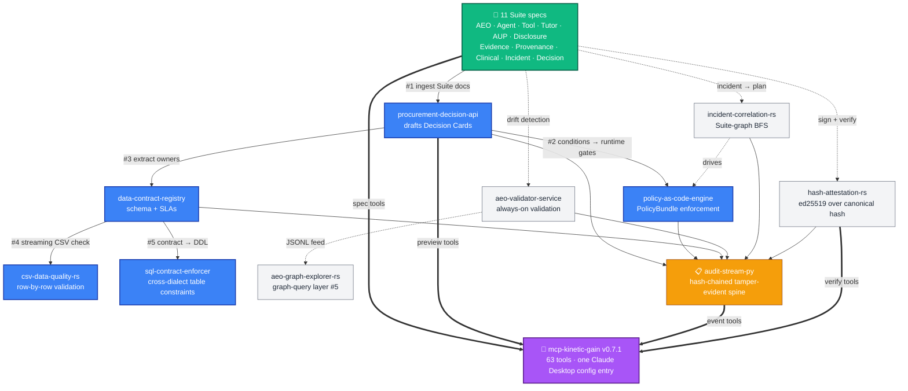
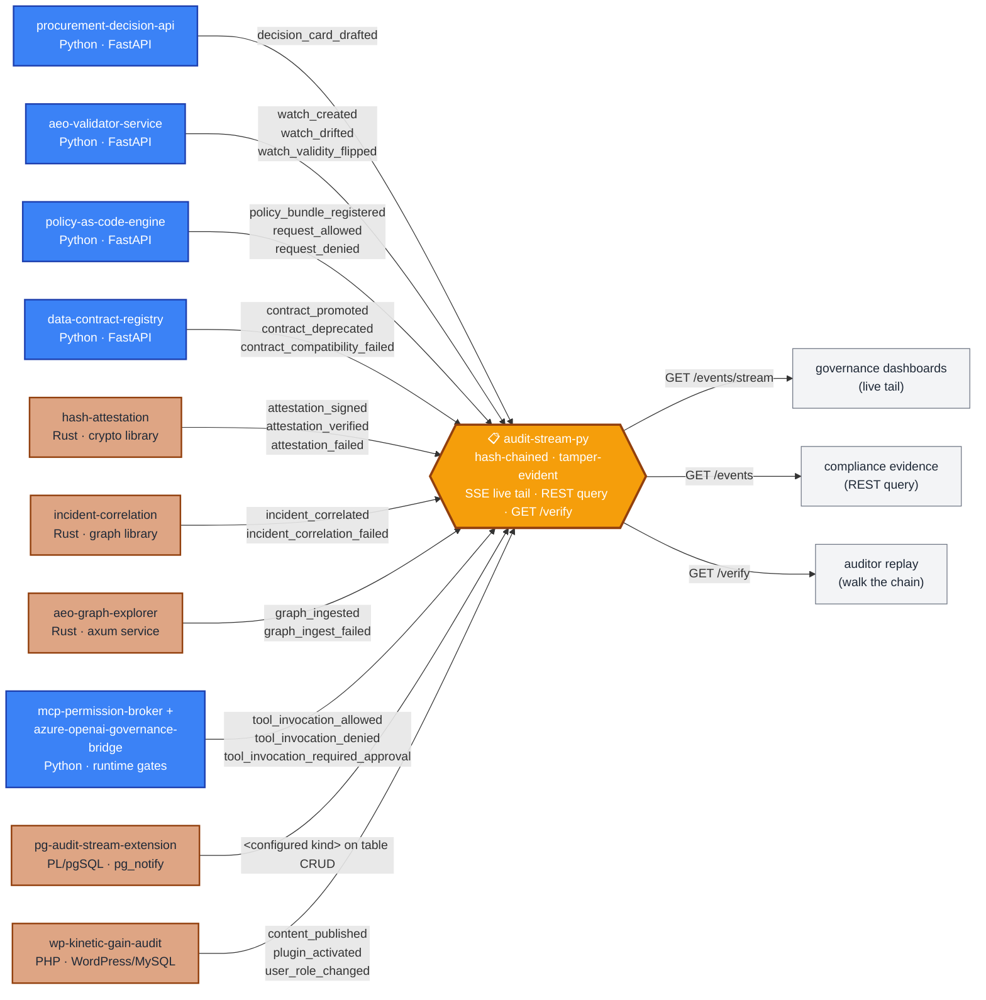

# Kinetic Gain Protocol Suite

> **A family of eleven open JSON specifications for the answer-engine and agent era — plus a fifteen-repo implementation stack that consumes them.**
> Five core specs · three EdTech extensions · one HealthTech extension · one cross-cutting incident-disclosure spec · one buyer-side procurement Decision Card · one unified visualizer · one operator console · one unified MCP server · **twenty-four live properties on kineticgain.com** · all AGPL-3.0 (specs) + MIT (implementations).
>
> Public front door: **[suite.kineticgain.com](https://suite.kineticgain.com)**.

[](https://console.kineticgain.com)

> **[Kinetic Gain Operator Console](https://console.kineticgain.com)** — mission-control for the whole Suite: an interactive topology mesh (*v0.2* — runtime-gate overlays for the MCP Permission Broker / Azure Governance Bridge / SQL Contract Enforcer, ed25519 signature posture, and blast-radius tracing across the hash-chained spine), a configurable SRE operator dashboard (savable layouts, simulation throttle, per-channel latency sliders, PDF export), and live audit-stream visualization. ([repo](https://github.com/mizcausevic-dev/kinetic-gain-operator-console))

[](https://kineticgain.com/.well-known/pulse-receipt.json) &nbsp; *We publish the specs AND we score against them. Live receipt at [kineticgain.com/.well-known/pulse-receipt.json](https://kineticgain.com/.well-known/pulse-receipt.json), refreshed weekly by [procurement-pulse-action](https://github.com/mizcausevic-dev/procurement-pulse-action) on kineticgain.com's own GitHub Actions.*

This repository is the **single landing** for the Suite — both for the **specs** (the "what to publish" layer) and for the **implementation stack** that consumes them (the "what to actually run" layer). Each spec lives in its own repo with full normative text, JSON Schema, examples, and a permissive cross-link table. This meta-repo is where you start when you want the map.

---

## 🧭 The suite at a glance

```
┌──────────────────── Core (Answer Engine / Agent layer) ────────────────────┐
│                                                                            │
│  AEO Protocol ──── entity declaration at /.well-known/aeo.json             │
│  Prompt Provenance ─ versioned, lineaged, reviewable LLM prompts          │
│  Agent Cards ───── capability + refusal disclosure for AI agents          │
│  AI Evidence Format ─ structured citations for LLM-generated claims       │
│  MCP Tool Cards ── per-tool disclosure for MCP servers                    │
│                                                                            │
└────────────────────────────────────────────────────────────────────────────┘
                                    │
                                    │ pairs with
                                    ▼
┌──────────────────── EdTech trio (vendor / district / student) ─────────────┐
│                                                                            │
│  AI Tutor Cards ── what an AI tutor does (vendor-side)                    │
│      ↕                                                                     │
│  Classroom AI AUP ─ what AI use is permitted (district / school / course) │
│      ↕                                                                     │
│  Student AI Disclosure ─ what the student actually did (per artifact)     │
│                                                                            │
└────────────────────────────────────────────────────────────────────────────┘

┌──────────────── HealthTech extension (vendor-side disclosure) ─────────────┐
│                                                                            │
│  Clinical AI Disclosure ── what a healthcare AI system does               │
│  HIPAA / FDA / SaMD posture · bias audits · EHR (FHIR / CDS Hooks)        │
│  references → Agent Card · AI Evidence · AI Incident Card                  │
│                                                                            │
└────────────────────────────────────────────────────────────────────────────┘
                                    │
                                    │ when things break
                                    ▼
┌──────────── Cross-cutting (vendor-published, references all) ──────────────┐
│                                                                            │
│  AI Incident Card ── post-incident disclosure ("CVE for AI agents")       │
│  references → Agent / Tutor / Tool Cards · Prompt Provenance · AI Evidence │
│                                                                            │
└────────────────────────────────────────────────────────────────────────────┘
                                    │
                                    │ buyer-side (when approving / rejecting)
                                    ▼
┌──────────── Cross-cutting (buyer-published, references vendor docs) ───────┐
│                                                                            │
│  AI Procurement Decision Card ── buyer's signed-off position on a vendor  │
│  status: approved / approved-with-conditions / rejected / withdrawn       │
│  references → AEO · Agent / Tool / Tutor / Clinical Cards · AI Evidence    │
│                                                                            │
└────────────────────────────────────────────────────────────────────────────┘
```

The Suite is **bilateral**: vendors publish disclosures (the first six rows); buyers publish Decision Cards that approve or reject those disclosures. AI Incident Cards close the loop when something breaks.

---

## 📐 Specifications

Every spec carries a top-level `<name>_version` field. The unified visualizer detects which spec a document is in by inspecting that single field.

| Spec | Repo | Detect via | Well-known path |
|---|---|---|---|
| **AEO Protocol** | [`aeo-protocol-spec`](https://github.com/mizcausevic-dev/aeo-protocol-spec) | `aeo_version` | `/.well-known/aeo.json` |
| **Prompt Provenance** | [`prompt-provenance-spec`](https://github.com/mizcausevic-dev/prompt-provenance-spec) | `provenance_version` | — |
| **Agent Cards** | [`agent-cards-spec`](https://github.com/mizcausevic-dev/agent-cards-spec) | `agent_card_version` | `/.well-known/agents/<agent_id>.json` |
| **AI Evidence Format** | [`ai-evidence-format-spec`](https://github.com/mizcausevic-dev/ai-evidence-format-spec) | `evidence_version` | — |
| **MCP Tool Cards** | [`mcp-tool-card-spec`](https://github.com/mizcausevic-dev/mcp-tool-card-spec) | `tool_card_version` | `/.well-known/mcp-tools/<tool_name>.json` |
| **AI Tutor Cards** _(EdTech)_ | [`ai-tutor-card-spec`](https://github.com/mizcausevic-dev/ai-tutor-card-spec) | `tutor_card_version` | `/.well-known/tutors/<tutor_id>.json` |
| **Student AI Disclosure** _(EdTech)_ | [`student-ai-disclosure-spec`](https://github.com/mizcausevic-dev/student-ai-disclosure-spec) | `disclosure_version` | — (travels with the artifact) |
| **Classroom AI AUP** _(EdTech)_ | [`classroom-ai-aup-spec`](https://github.com/mizcausevic-dev/classroom-ai-aup-spec) | `aup_version` | `/.well-known/ai-aup.json` |
| **Clinical AI Disclosure** _(HealthTech)_ | [`clinical-ai-disclosure-spec`](https://github.com/mizcausevic-dev/clinical-ai-disclosure-spec) | `clinical_ai_card_version` | `/.well-known/clinical-ai/<system_id>.json` |
| **AI Incident Card** _(cross-cutting, vendor-side)_ | [`ai-incident-card-spec`](https://github.com/mizcausevic-dev/ai-incident-card-spec) | `incident_card_version` | `/.well-known/ai-incidents/<id>.json` (+ index at `/.well-known/ai-incidents.json`) |
| **AI Procurement Decision Card** _(cross-cutting, buyer-side)_ | [`ai-procurement-decision-spec`](https://github.com/mizcausevic-dev/ai-procurement-decision-spec) | `decision_card_version` | `/.well-known/procurement-decisions/<id>.json` |

All eleven: AGPL-3.0 spec text, freely implementable, v0.1 draft, JSON Schema draft 2020-12, tagged [`kinetic-gain-protocol-suite`](https://github.com/topics/kinetic-gain-protocol-suite). The **[NIST AI RMF crosswalk](https://suite.kineticgain.com/docs/nist-rmf-crosswalk.md)** maps every spec — plus the implementation tooling below — to specific NIST AI RMF subcategories.

---

## 🧱 Reference implementations

The Suite now has real implementation tooling attached to several of its disclosure and distribution patterns:

- **MCP Tool Cards**
  - [`mcp-tool-card-generator`](https://github.com/mizcausevic-dev/mcp-tool-card-generator) — emits Tool Card disclosures directly from MCP `tools/list` output
  - [`mcp-registry-risk-scanner`](https://github.com/mizcausevic-dev/mcp-registry-risk-scanner) — validates manifest and registry posture around published MCP servers
  - [`mcp-tools-diff`](https://github.com/mizcausevic-dev/mcp-tools-diff) — detects `tools/list` drift and breaking-change posture over time
- **Agent Cards**
  - [`agent-card-runtime-adapters`](https://github.com/mizcausevic-dev/agent-card-runtime-adapters) — maps Agent Cards into runtime adapters for OpenAI, Anthropic, and Vercel execution layers
- **AI Evidence Format / Evidence Ledger**
  - [`rag-evidence-graph`](https://github.com/mizcausevic-dev/rag-evidence-graph) — corpus-level citation graph and evidence coverage analysis
  - [`rag-evidence-trace-linker`](https://github.com/mizcausevic-dev/rag-evidence-trace-linker) — per-call trace linkage for evidence integrity on RAG and generation flows
- **`/.well-known/` distribution pattern**
  - [`wellknown-index-aggregator`](https://github.com/mizcausevic-dev/wellknown-index-aggregator) — builds and validates `/.well-known/index.json` for multi-doc publisher estates
  - [`governance-disclosure-operator`](https://github.com/mizcausevic-dev/governance-disclosure-operator) — Kubernetes-native publisher for governance disclosures

---

## 🛠️ Suite × Implementations
The Suite is a set of specs. **This section is the software that consumes them** — fifteen repos across Tiers A–E, all CI-green, semver-tagged, MIT-licensed, with **five cross-ecosystem hooks** tying them together. Grouped by the buyer most likely to land on the repo first.

### 🕸️ How it composes



**Green** = the spec foundation. **Blue** = the five cross-ecosystem hooks that make this a stack rather than a pile of repos. **Grey** = supporting tools that feed either side. **Amber** = the tamper-evident audit-stream spine every governance moment writes to. **Purple** = the unified MCP surface that exposes the whole thing to Claude.

### 📋 The audit-stream spine — eleven producers, five runtimes

Zoom in on the amber spine: every governance moment in the stack writes to **one hash-chained, tamper-evident log** via `audit-stream-py`. Same opt-in env-var contract (`AUDIT_STREAM_URL`) across every producer; same best-effort semantics (a failed POST is logged, never raised). The original seven (four FastAPI services + three Rust crates) are now joined by four runtime + data-tier producers — **`mcp-permission-broker`** and **`azure-openai-governance-bridge`** (tool-invocation gates), **`pg-audit-stream-extension`** (Postgres CRUD via `pg_notify`), and **`wp-kinetic-gain-audit`** (WordPress/MySQL) — so the spine now spans **Python, Rust, PL/pgSQL, PHP, and Azure Functions**. One verifiable narrative an auditor can replay end-to-end, no matter which tier emitted the event.



**Blue** = Python FastAPI producers. **Tan** = Rust producers (two libraries gated behind `--features audit-stream` so library consumers can strip out the HTTP dep, one axum service with the feature on by default). **Amber** = the spine itself. **Grey** = the three downstream surfaces auditors and operators consume.

Adding the next producer is a ~60-line module: copy the `audit_stream` shape (Python, Rust, PL/pgSQL, or PHP), pick your event kinds, point at `AUDIT_STREAM_URL`. The data-tier producers prove the point — `pg-audit-stream-extension` catches direct DML the application path would miss, and `wp-kinetic-gain-audit` brings the same tamper-evident chain to any WordPress estate. Next natural candidates: `slo-budget-tracker` (`slo_burn_started` / `slo_recovered`) or `reliability-toolkit-rs` (`breaker_opened` / `breaker_recovered`).

### 🛒 Procurement reviewer / buyer-side governance

| Repo | Lang | What it does |
|---|---|---|
| [`procurement-decision-api`](https://github.com/mizcausevic-dev/procurement-decision-api) | Python · FastAPI | Drafts AI Procurement Decision Cards from a buyer rubric and a set of vendor Suite documents (AEO + agent-card + tool-card + ai-evidence + …). **The first cross-ecosystem bridge** in the portfolio — Suite × Decision Intelligence. |
| [`policy-as-code-engine`](https://github.com/mizcausevic-dev/policy-as-code-engine) | Python · FastAPI | Declarative policy evaluator. Headline: `POST /bundles/from-decision-card` turns a Decision Card's `conditions[]` into a runtime-enforceable PolicyBundle. Closes the loop from "buyer signed off" to "request gated." **Cross-ecosystem hook #2.** |
| [`hash-attestation-rs`](https://github.com/mizcausevic-dev/hash-attestation-rs) | Rust · ed25519 | Sign and verify Suite documents with ed25519 over the canonical-hash convention every other Suite repo already uses. **The missing "this AEO actually came from the vendor" layer.** |

### 🌐 AEO consumer / spec implementer

| Repo | Lang | What it does |
|---|---|---|
| [`aeo-validator-service`](https://github.com/mizcausevic-dev/aeo-validator-service) | Python · FastAPI | Always-on HTTP validator for AEO + all 11 Suite docs. Auto-detects the spec via `*_version` sniffing, hashes canonically, tracks **drift** across re-checks (`POST /watches/{id}/recheck` returns a structured `DriftReport`). Layer 4 of the AEO Reference Stack. |
| [`aeo-graph-explorer-rs`](https://github.com/mizcausevic-dev/aeo-graph-explorer-rs) | Rust · axum · petgraph | HTTP graph-query service over `aeo-crawler` JSONL output. `GET /neighbors`, `GET /shortest-path`, `GET /find-by-claim`, atomic `POST /ingest`. Layer 5 of the AEO Reference Stack. |
| [`incident-correlation-rs`](https://github.com/mizcausevic-dev/incident-correlation-rs) | Rust · petgraph | Walks the Suite graph from an `IncidentCard` and emits a structured remediation plan: `DecisionCard → RecheckPolicy`, `Vendor → RequestReview`, AEO/agent/tool → `Revalidate`. |

### 🗃️ Data team

| Repo | Lang | What it does |
|---|---|---|
| [`data-contract-registry`](https://github.com/mizcausevic-dev/data-contract-registry) | Python · FastAPI | Schema registry with semver versioning, compatibility checks (backward / forward / full), declared owners, freshness SLAs. **`POST /contracts/owners/from-decision-card` pulls Owner records out of a Procurement Decision Card. Cross-ecosystem hook #3.** |
| [`csv-data-quality-rs`](https://github.com/mizcausevic-dev/csv-data-quality-rs) | Rust · tokio · csv | Streaming CSV validator against a `data-contract-registry` contract. Async, row-by-row, structured violation report (`required` / `bad_type` / `enum_mismatch` / `column_count_mismatch` / `invalid_json`). **Cross-ecosystem hook #4.** |
| [`sql-contract-enforcer`](https://github.com/mizcausevic-dev/sql-contract-enforcer) | Python · SQL | Turns a `data-contract-registry` contract into enforceable cross-dialect DDL (CHECK / NOT NULL / UNIQUE / PK / FK) for Postgres, MySQL, Snowflake, BigQuery, plus a contract-vs-schema checker for CI. Dialect-aware (BigQuery demotes CHECK/UNIQUE to comments + PK/FK to NOT ENFORCED). **Cross-ecosystem hook #5.** |

### 🛡️ SRE / Platform reliability stack

Ten repos that compose into a single layered reliability story: identity → rate limits → canary → registry → SLO budget → Rust primitives → feature flags → shadow traffic → tamper-evident audit log.

| Repo | Lang | What it does |
|---|---|---|
| [`slo-budget-tracker`](https://github.com/mizcausevic-dev/slo-budget-tracker) | Python · FastAPI · Prometheus | SLO + error-budget library, multi-window burn-rate alerts (SRE workbook threshold 14.4). |
| [`reliability-toolkit-rs`](https://github.com/mizcausevic-dev/reliability-toolkit-rs) | Rust · Tokio | Token-bucket rate limiter · 3-state circuit breaker · exponential-backoff retry with jitter · bulkhead. |
| [`feature-flag-rs`](https://github.com/mizcausevic-dev/feature-flag-rs) | Rust · Tokio | Server-side flag eval — targeting rules, sticky percentage rollouts (SHA-256 bucketing, no RNG), hot reload. |
| [`request-shadow-rs`](https://github.com/mizcausevic-dev/request-shadow-rs) | Rust · Tokio | Async request mirroring with sampling + divergence detection. The SRE primitive for safe migrations. |
| [`audit-stream-py`](https://github.com/mizcausevic-dev/audit-stream-py) | Python · FastAPI · SSE | Append-only governance event stream, hash-chained for tamper-evidence. Every portfolio repo can produce events here. |
| _(Plus 5 earlier reliability repos)_ | Python | `rate-limit-shield` · `identity-mesh` · `agent-canary` · `model-registry-pro` — defense-in-depth predecessors. |

### 🤖 MCP / Claude integrator

| Repo | Lang | What it does |
|---|---|---|
| [`mcp-kinetic-gain`](https://github.com/mizcausevic-dev/mcp-kinetic-gain) | TypeScript | **Unified Suite MCP server** — 63 tools across 11 specs (v0.7.1). One Claude Desktop config entry. Headline tools: `aup_check_compliance` (joins AUP + Disclosure into one allow/deny call); `decision_card_validate` (enforces the full Decision Card conditional rule set). |
| [`mcp-reliability-toolkit`](https://github.com/mizcausevic-dev/mcp-reliability-toolkit) | TypeScript | Reliability MCP server — `compute_slo_burn`, `design_rate_limiter`, `design_circuit_breaker`, `compose_reliability_pattern`. Same math as `slo-budget-tracker`; emits Python + Rust configs. |
| [`mcp-decision-intelligence`](https://github.com/mizcausevic-dev/mcp-decision-intelligence) | TypeScript | Decision Intelligence MCP server — `validate_decision_card`, `preview_policy_bundle`, `plan_incident_remediation`, `check_contract_compatibility`. Read-only preview of what the live Python/Rust services would compute. |

### 🚦 Runtime enforcement — turning "buyer signed off" into "request denied"

The Decision Card layer decides; these gates enforce, at the moment a tool is invoked, and write every verdict to the spine:

| Repo | Lang | What it does |
|---|---|---|
| [`mcp-permission-broker`](https://github.com/mizcausevic-dev/mcp-permission-broker) | Python | Runtime gate between a Decision Card and an MCP tool call. Composes Decision Card conditions into deny-trumps-allow PolicyBundles; emits `tool_invocation_*` to the spine. |
| [`azure-openai-governance-bridge`](https://github.com/mizcausevic-dev/azure-openai-governance-bridge) | Python · Azure Functions · Bicep | The Azure-native sibling — an Azure Function in front of Azure OpenAI enforcing the same PolicyBundle contract on every chat-completion call (deployment + each declared tool). Puts the Suite's governance on the data path enterprises actually run AI on. |

### The five cross-ecosystem hooks

What makes the stack *a stack* rather than a list of repos:

1. **`procurement-decision-api` → Suite documents.** Ingests AEO / agent-card / tool-card / ai-evidence by URL; emits a Decision Card. (Suite × Decision Intelligence.)
2. **`policy-as-code-engine` → `procurement-decision-api`.** `POST /bundles/from-decision-card` turns approve / reject / approve-with-conditions into runtime-enforceable allow / deny / per-condition gates.
3. **`data-contract-registry` → `procurement-decision-api`.** `POST /contracts/owners/from-decision-card` extracts buyer + decision_maker into Owner records so freshly registered contracts carry paging info nobody re-types.
4. **`csv-data-quality-rs` → `data-contract-registry`.** Streaming CSV validator against a registered contract — producers prove their output matches, row by row.
5. **`sql-contract-enforcer` → `data-contract-registry`.** Compiles the same contract into cross-dialect DDL (CHECK / NOT NULL / UNIQUE / PK / FK across Postgres, MySQL, Snowflake, BigQuery) — enforcing at the table boundary what hook #4 validates row-wise.

The implementation stack is **independently usable** — any repo composes with the rest, none requires it — and the Decision Card now enforces at three layers: the MCP tool call (`mcp-permission-broker`), the Azure OpenAI call (`azure-openai-governance-bridge`), and the database table (`sql-contract-enforcer`).

---

## 🔌 One MCP server. 63 tools. Eleven specs.

[`mcp-kinetic-gain`](https://github.com/mizcausevic-dev/mcp-kinetic-gain) (v0.7.1) is the unified [Model Context Protocol](https://modelcontextprotocol.io) server exposing every runtime Kinetic Gain spec as callable tools. One Claude Desktop / Cursor / MCP-client config entry; 63 tools across all eleven specs.

| Spec | Tools |
|---|---|
| AEO Protocol | `aeo_fetch` · `aeo_inspect` · `aeo_get_claim` · `aeo_well_known_url` |
| Prompt Provenance | `prompt_provenance_validate` · `prompt_provenance_inspect` · `prompt_provenance_eval_result` |
| Agent Cards | `agent_card_well_known_url` · `agent_card_inspect` · `agent_card_tool_disclosure` · `agent_card_validate` |
| AI Evidence Format | `ai_evidence_validate` · `ai_evidence_inspect` · `ai_evidence_verify_hash` |
| MCP Tool Cards | `tool_card_well_known_url` · `tool_card_inspect` · `tool_card_tested_with` · `tool_card_validate` |
| AI Tutor Cards | `tutor_card_well_known_url` · `tutor_card_fetch` · `tutor_card_validate` · `tutor_card_inspect` · `tutor_card_subject_check` · `tutor_card_coppa_check` |
| Student AI Disclosure | `disclosure_validate` · `disclosure_inspect` · `disclosure_verify_artifact_hash` · `disclosure_verify_prompt_hash` · `disclosure_aup_check` |
| Classroom AI AUP | `aup_well_known_url` · `aup_fetch` · `aup_validate` · `aup_inspect` · **`aup_check_compliance`** |
| Clinical AI Disclosure | `clinical_ai_well_known_url` · `clinical_ai_validate` · `clinical_ai_inspect` · `clinical_ai_samd_check` |
| AI Incident Card | `incident_validate` · `incident_inspect` · `incident_index_fetch` · `incident_affected_walk` |
| AI Procurement Decision Card | **`decision_card_validate`** · `decision_card_inspect` · `decision_card_conditions` · `decision_card_signature_check` |

126 tests pass · typecheck clean · stdio MCP server, drops into any MCP-compatible client. Sibling MCP servers for the Reliability Stack (`mcp-reliability-toolkit`) and Decision Intelligence (`mcp-decision-intelligence`) exist for narrower use cases.

---

## 🖼️ One visualizer. Eleven specs.

[`kinetic-gain-visualizer`](https://mizcausevic-dev.github.io/kinetic-gain-visualizer/) auto-detects the spec from the top-level `*_version` field and renders the appropriate procurement-grade view. Live on GitHub Pages.

- **Visualize** — the auto-detected renderer (FERPA / COPPA / GDPR badges for tutor cards, role-tone pills + artifact-hash binding for disclosures, vendor-requirements card in dark/authority tone for AUPs, full conditional-rule preview for Decision Cards, etc.)
- **Editor** — paste any spec document and watch the right view light up
- **Architecture** — the 11-spec map
- **Tools** — searchable catalog of all 63 MCP tools
- **About** — detection model + cross-links

---

## ⚙️ Suite governance Actions — 9-action CI ecosystem

A pre-built set of GitHub Actions for **PR-gating governance documents** before merge. Drop them into any repo that holds AgentCards / Tool Cards / prompt-provenance / evidence bundles / OTel spans and they post a Markdown summary as a PR comment + fail the build on high-severity findings.

### Per-protocol fleet-summary gates (4)
| Action | Wraps | Catches |
|---|---|---|
| [`agent-card-fleet-summary-action`](https://github.com/mizcausevic-dev/agent-card-fleet-summary-action) | `agent-card-fleet-summary` | autonomous-without-IRU, destructive-on-non-autonomous, persistent-memory-without-refusal-taxonomy |
| [`mcp-tool-card-fleet-summary-action`](https://github.com/mizcausevic-dev/mcp-tool-card-fleet-summary-action) | `mcp-tool-card-fleet-summary` | destructive-without-human-approval, high-PII-without-rate-limit, writes-secrets-without-audit |
| [`prompt-provenance-fleet-summary-action`](https://github.com/mizcausevic-dev/prompt-provenance-fleet-summary-action) | `prompt-provenance-fleet-summary` | approved-without-evaluations, no-reviewers, failing-eval-on-approved, deprecated-still-referenced |
| [`evidence-bundle-fleet-summary-action`](https://github.com/mizcausevic-dev/evidence-bundle-fleet-summary-action) | `evidence-bundle-fleet-summary` | bundle-expired, unsigned-regulated-bundle, cross-bundle-hash-collision, oversized-bundle |

### Cross-protocol governance gates (3)
| Action | Catches |
|---|---|
| [`kg-suite-spec-version-tracker-action`](https://github.com/mizcausevic-dev/kg-suite-spec-version-tracker-action) | **Version drift** — same protocol on two different spec versions in one fleet |
| [`kg-suite-conformance-runner-action`](https://github.com/mizcausevic-dev/kg-suite-conformance-runner-action) | **Structural conformance** — missing required top-level blocks per spec |
| [`kg-suite-canonicalize-action`](https://github.com/mizcausevic-dev/kg-suite-canonicalize-action) | **Silent edits** — doc's canonical sha256 changed without a version bump |

### Cost + cluster gates (2 — pre-existing)
| Action | Catches |
|---|---|
| [`llm-cost-rollup-action`](https://github.com/mizcausevic-dev/llm-cost-rollup-action) | GenAI FinOps — budget breaches across OTel cost-annotated spans |
| [`k8s-pre-merge-action`](https://github.com/mizcausevic-dev/k8s-pre-merge-action) | K8s pre-merge — deprecated APIs, RBAC over-scope, Pod Security, Helm values coverage |

All nine are composite Node 20 actions with `dist/` committed for SHA/tag pinning — no build step needed in the consuming workflow.

---

## 🛡️ Testing artifact

| Repo | What it does |
|---|---|
| [`prompt-injection-bench`](https://github.com/mizcausevic-dev/prompt-injection-bench) | Open 30-attack prompt-injection corpus + Python harness. Every record carries an `agent_card_refusal_categories` back-ref to the [Agent Card](https://github.com/mizcausevic-dev/agent-cards-spec) `refusal_taxonomy[].category` it tests. A vendor can grep their declared categories against the corpus to verify their stated commitments hold under attack — and failed runs become natural inputs for [AI Incident Cards](https://github.com/mizcausevic-dev/ai-incident-card-spec). **Visual harness live at [bench.kineticgain.com](https://bench.kineticgain.com).** |

The bench is **not a twelfth spec** — it's the *testing-counterpart* to the disclosure layer. The Suite tells you what an agent should refuse; the bench tells you whether it actually does.

---

## 🌐 Live properties — 32 total

### Hubs + tools (8)
| URL | What it serves |
|---|---|
| **[suite.kineticgain.com](https://suite.kineticgain.com)** | **Canonical front door** for the entire Suite — 11-spec map, full spec table, two-front-doors section, NIST RMF crosswalk |
| [docs.kineticgain.com](https://docs.kineticgain.com) | **Quickstart hub** — per-role guides + canonical `/.well-known/` path map |
| [directory.kineticgain.com](https://directory.kineticgain.com) | **Vendor directory** — curated list of domains publishing Kinetic Gain documents |
| [examples.kineticgain.com](https://examples.kineticgain.com) | **Examples gallery** — sidebar of 11 specs, click for canonical example with JSON highlight |
| [walker.kineticgain.com](https://walker.kineticgain.com) | **well-known-walker** — paste any domain, see every Kinetic Gain disclosure it publishes |
| [bench.kineticgain.com](https://bench.kineticgain.com) | **prompt-injection-bench** — paste a JSONL transcript, see pass rates by category and severity |
| [pulse.kineticgain.com](https://pulse.kineticgain.com) | **AI Procurement Pulse** — quarterly research index of vendor disclosure across the open internet. [Issue #1 "The Zero Baseline"](https://pulse.kineticgain.com/issue-1/) is live (powered by `procurement-pulse-engine` + `well-known-probe-js`) |
| [console.kineticgain.com](https://console.kineticgain.com) | **Operator Console** — mission-control for the Suite: interactive topology mesh (*v0.2* — runtime-gate overlays, ed25519 signature posture, blast-radius tracing), configurable SRE operator dashboard, live audit-stream visualization, PDF export ([repo](https://github.com/mizcausevic-dev/kinetic-gain-operator-console)) |

### Per-spec landings (11)
| URL | Spec |
|---|---|
| [aeo.kineticgain.com](https://aeo.kineticgain.com) | AEO Protocol — interactive visualizer |
| [prompts.kineticgain.com](https://prompts.kineticgain.com) | Prompt Provenance |
| [agents.kineticgain.com](https://agents.kineticgain.com) | Agent Cards |
| [evidence.kineticgain.com](https://evidence.kineticgain.com) | AI Evidence Format |
| [toolcards.kineticgain.com](https://toolcards.kineticgain.com) | MCP Tool Cards |
| [tutor.kineticgain.com](https://tutor.kineticgain.com) | AI Tutor Cards (EdTech) |
| [student.kineticgain.com](https://student.kineticgain.com) | Student AI Disclosure (EdTech) |
| [aup.kineticgain.com](https://aup.kineticgain.com) | Classroom AI AUP (EdTech) |
| [clinical.kineticgain.com](https://clinical.kineticgain.com) | Clinical AI Disclosure (HealthTech) |
| [incidents.kineticgain.com](https://incidents.kineticgain.com) | AI Incident Card (cross-cutting, vendor-side) |
| [decisions.kineticgain.com](https://decisions.kineticgain.com) | AI Procurement Decision Card (cross-cutting, buyer-side) |

### Earlier product surfaces (5)
| URL | What it does |
|---|---|
| [gv.kineticgain.com](https://gv.kineticgain.com) | GitVisualizer — visual portfolio intelligence for any GitHub user |
| [mcp.kineticgain.com](https://mcp.kineticgain.com) | MCP Sentinel — governance dashboard for MCP servers |
| [rag.kineticgain.com](https://rag.kineticgain.com) | RAG Sentinel — hallucination, drift, citation quality monitoring |
| [observe.kineticgain.com](https://observe.kineticgain.com) | AgentObserve — operator console for AI agent fleets |
| [mizcausevic-dev.github.io/kinetic-gain-visualizer](https://mizcausevic-dev.github.io/kinetic-gain-visualizer/) | Unified visualizer (GitHub Pages, all 11 specs) |

### Cloud Identity, Platform, FinOps & Threat Detection Governance lane (8)
Production-hardened (v1.0-prod) synthetic-data operator consoles covering the multi-cloud admin stack — Microsoft, AWS, GCP, Azure. AGPL-3.0-or-later, dual-Node CI, dependabot, 95%+ statement coverage, each deployed on its own GitHub Pages subdomain.

| URL | What it does | Repo |
|---|---|---|
| [entra.kineticgain.com](https://entra.kineticgain.com) | Microsoft Entra access reviews, privileged-role auto-approval drift, reviewer self-review detection, decision-overdue posture | [`entra-access-review-control-plane`](https://github.com/mizcausevic-dev/entra-access-review-control-plane) |
| [intune.kineticgain.com](https://intune.kineticgain.com) | Microsoft Intune device compliance, jailbreak/root detection, encryption gaps, OS-drift, stale check-ins, BYOD scope | [`intune-device-compliance-ops`](https://github.com/mizcausevic-dev/intune-device-compliance-ops) |
| [retention.kineticgain.com](https://retention.kineticgain.com) | Microsoft 365 Purview retention coverage and eDiscovery custodian / hold orchestration | [`m365-retention-case-orchestrator`](https://github.com/mizcausevic-dev/m365-retention-case-orchestrator) |
| [aws.kineticgain.com](https://aws.kineticgain.com) | AWS IAM Access Analyzer posture, public-access bindings, cross-account trust, remediation sequencing | [`aws-iam-access-analyzer-console`](https://github.com/mizcausevic-dev/aws-iam-access-analyzer-console) |
| [guardduty.kineticgain.com](https://guardduty.kineticgain.com) | AWS GuardDuty detector posture, threat-finding triage, credential exfiltration / crypto-mining / anomalous-API behavior, response sequencing | [`aws-guardduty-triage-board`](https://github.com/mizcausevic-dev/aws-guardduty-triage-board) |
| [gcp.kineticgain.com](https://gcp.kineticgain.com) | GCP IAM snapshot drift, public `allUsers` bindings, `roles/editor` creep, service-account token-creator grants, org-policy mismatch | [`gcp-iam-policy-diff-lab`](https://github.com/mizcausevic-dev/gcp-iam-policy-diff-lab) |
| [billing.kineticgain.com](https://billing.kineticgain.com) | GCP billing-anomaly routing, budget breaches, spend-spike escalation, idle commitments, unlabeled-cost drift, billing-export gaps | [`gcp-billing-anomaly-router`](https://github.com/mizcausevic-dev/gcp-billing-anomaly-router) |
| [zone.kineticgain.com](https://zone.kineticgain.com) | Azure landing-zone baseline drift, owner-role drift, missing deny assignments, disabled Defender, diagnostics gaps, route bypass | [`azure-landing-zone-drift-radar`](https://github.com/mizcausevic-dev/azure-landing-zone-drift-radar) |

---

## 🪜 Quickstart paths

Pick the entry that matches what you want to do:

**I want to declare my entity / agent / tool.**
Start at the relevant spec's `examples/` folder, fork an example, validate against the schema, serve at the well-known URL.

**I want to consume Kinetic Gain documents from an LLM agent.**
Install [`mcp-kinetic-gain`](https://github.com/mizcausevic-dev/mcp-kinetic-gain), add one entry to your Claude Desktop config, get 63 tools.

**I want to see what a document looks like.**
Open the [unified visualizer](https://mizcausevic-dev.github.io/kinetic-gain-visualizer/), pick an example from the Editor view.

**I'm a school district choosing AI vendors.**
Read the [Classroom AI AUP spec](https://github.com/mizcausevic-dev/classroom-ai-aup-spec). Author your AUP. Require [Tutor Cards](https://github.com/mizcausevic-dev/ai-tutor-card-spec) from vendors. Require [Student AI Disclosures](https://github.com/mizcausevic-dev/student-ai-disclosure-spec) from learners. Three JSON documents, two joins, one allow/deny answer per submission.

**I'm a vendor trying to sell into K-12.**
Publish a [Tutor Card](https://github.com/mizcausevic-dev/ai-tutor-card-spec) at `/.well-known/tutors/<id>.json`. A district AUP can then validate your card against its `vendor_requirements` in milliseconds.

**I'm a healthcare AI vendor selling into hospitals.**
Publish a [Clinical AI Disclosure](https://github.com/mizcausevic-dev/clinical-ai-disclosure-spec) at `/.well-known/clinical-ai/<system_id>.json` with your FDA / SaMD / HIPAA / EHR-integration posture. A CMIO can read it in seconds; the bias-audit URI is procurement-blocking for SaMD class II+.

**I'm a procurement reviewer evaluating an AI vendor.**
Stand up [`procurement-decision-api`](https://github.com/mizcausevic-dev/procurement-decision-api), feed it the vendor's Suite docs + your rubric, get back a Draft Decision Card. Sign it. Want runtime enforcement? Send the signed card to [`policy-as-code-engine`](https://github.com/mizcausevic-dev/policy-as-code-engine)'s `POST /bundles/from-decision-card` — every condition becomes a deny-by-default gate.

**I'm an SRE adopting the reliability stack.**
[`slo-budget-tracker`](https://github.com/mizcausevic-dev/slo-budget-tracker) for the SLO math, [`reliability-toolkit-rs`](https://github.com/mizcausevic-dev/reliability-toolkit-rs) for rate-limiter + breaker + retry + bulkhead, [`request-shadow-rs`](https://github.com/mizcausevic-dev/request-shadow-rs) for migrations, [`audit-stream-py`](https://github.com/mizcausevic-dev/audit-stream-py) as the tamper-evident spine.

**I'm a data team enforcing contracts.**
[`data-contract-registry`](https://github.com/mizcausevic-dev/data-contract-registry) to manage contracts (semver + compatibility checks). [`csv-data-quality-rs`](https://github.com/mizcausevic-dev/csv-data-quality-rs) in CI: load the contract, validate the produced CSV, fail the build on violations.

**An agent of mine misbehaved and I need to disclose.**
Publish an [AI Incident Card](https://github.com/mizcausevic-dev/ai-incident-card-spec) at `/.well-known/ai-incidents/<id>.json` and add it to your `/.well-known/ai-incidents.json` index. Run [`incident-correlation-rs`](https://github.com/mizcausevic-dev/incident-correlation-rs) to walk the Suite graph and produce a remediation plan in one pass.

**I want to verify my agent's declared refusals hold under attack.**
Run [`prompt-injection-bench`](https://github.com/mizcausevic-dev/prompt-injection-bench) against your agent. Every attack carries an `agent_card_refusal_categories` back-ref to your Agent Card's `refusal_taxonomy[].category` values. Drop the result into your Agent Card's `evaluations[]` field.

---

## 📦 AEO Reference Stack (the depth example, 5 layers)

The AEO Protocol is the oldest spec in the suite and has the most complete tooling. It's the canonical depth example — every layer you'd want for any spec.

| Layer | Repos |
|---|---|
| **1. SDKs** | [`aeo-sdk-python`](https://github.com/mizcausevic-dev/aeo-sdk-python) (live on [PyPI](https://pypi.org/project/aeo-protocol/)) · [`aeo-sdk-typescript`](https://github.com/mizcausevic-dev/aeo-sdk-typescript) · [`aeo-sdk-rust`](https://github.com/mizcausevic-dev/aeo-sdk-rust) · [`aeo-sdk-go`](https://github.com/mizcausevic-dev/aeo-sdk-go) · [`aeo-sdk-swift`](https://github.com/mizcausevic-dev/aeo-sdk-swift) |
| **2. CLI** | [`aeo-cli`](https://github.com/mizcausevic-dev/aeo-cli) — `aeo validate / fetch / inspect / claim` against a live well-known URL |
| **3. Crawler** | [`aeo-crawler`](https://github.com/mizcausevic-dev/aeo-crawler) — BFS over AEO graphs, JSONL output |
| **4. Validator service** | [`aeo-validator-service`](https://github.com/mizcausevic-dev/aeo-validator-service) — always-on HTTP validator for all 11 Suite docs; tracks drift via `POST /watches/{id}/recheck` |
| **5. Graph explorer** | [`aeo-graph-explorer-rs`](https://github.com/mizcausevic-dev/aeo-graph-explorer-rs) — Rust + axum + petgraph graph-query service over the crawler's JSONL output |
| **MCP server (AEO-only)** | [`mcp-aeo-server`](https://github.com/mizcausevic-dev/mcp-aeo-server) — superseded by `mcp-kinetic-gain` but useful as a single-spec install |

The same five-layer pattern is now feasible for other specs: the Tutor Card and Decision Card both have clear paths to crawler + validator + explorer implementations once vendor adoption justifies the build.

---

## 🤝 Status & contribution

**v0.1 draft across all eleven specs · v0.1.0 across all fifteen implementation repos.** Stable enough to publish; designed to evolve. Issues and pull requests welcome on any repo. Discussion of cross-spec concerns happens here in this meta-repo.

A future v0.2 sweep will probably add: detached cryptographic signing across the family (foundation already shipped in [`hash-attestation-rs`](https://github.com/mizcausevic-dev/hash-attestation-rs)), an automated `kinetic-gain-protocol-suite` validator that walks document references end-to-end, and a conformance suite for MCP servers claiming Kinetic Gain support.

## 📜 License

Specifications, JSON Schemas, examples, and this meta-README: **AGPL-3.0**.
Implementation repos (procurement-decision-api, policy-as-code-engine, slo-budget-tracker, reliability-toolkit-rs, audit-stream-py, hash-attestation-rs, and the rest): **MIT**.
Supporting sites are unrestricted under their own licenses.

## 👤 Author

**Miz Causevic** · Enterprise Technologist · Boston, MA
[GitHub](https://github.com/mizcausevic-dev) · [LinkedIn](https://www.linkedin.com/in/mirzacausevic/) · [Kinetic Gain](https://kineticgain.com) · [Medium](https://medium.com/@mizcausevic/) · [Skills](https://mizcausevic.com/skills/)
